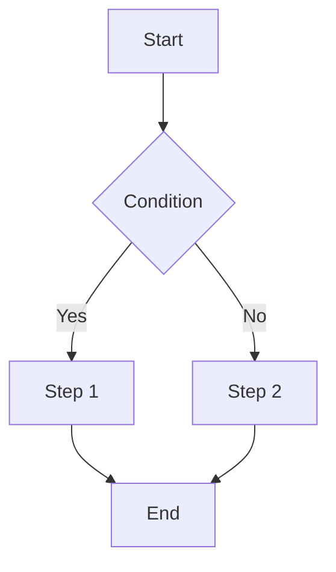
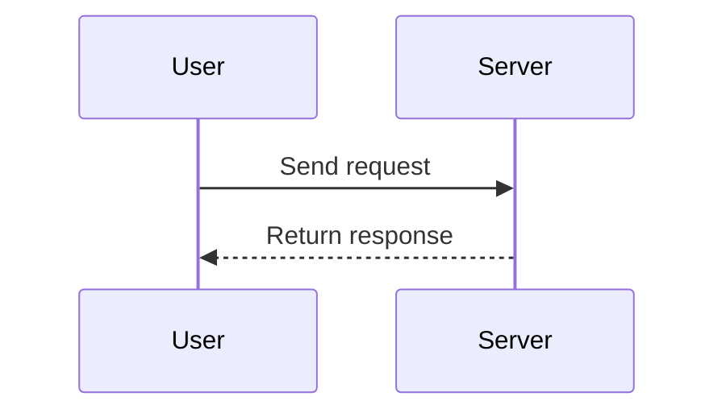
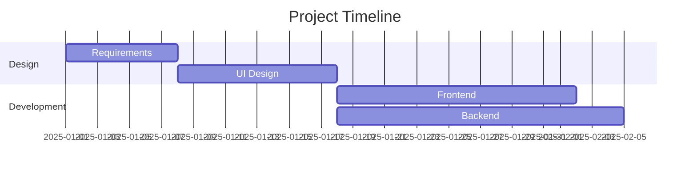
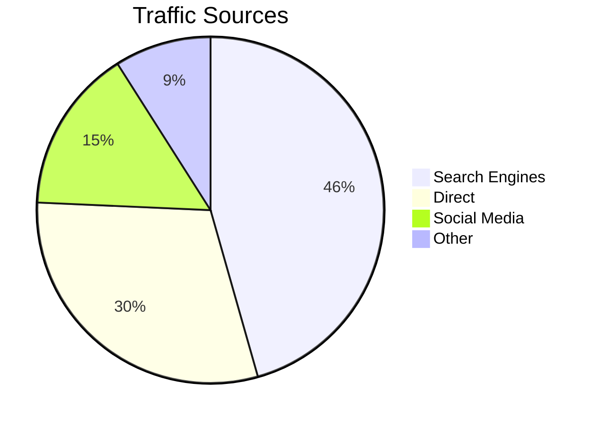
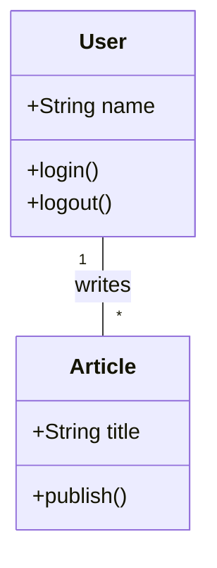
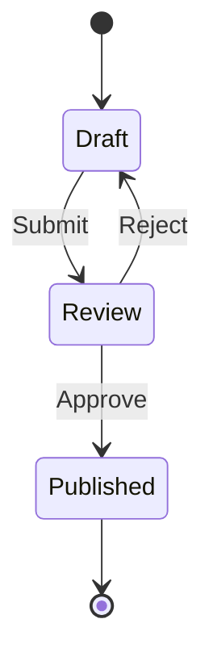

# Writing Posts

This guide covers how to write and manage blog posts in Firefly, including Frontmatter configuration, Markdown syntax, math formulas, Mermaid diagrams, embedded videos, and more.

## File Location

Post files go in the `src/content/posts/` directory. You can place `.md` / `.mdx` files directly or create subdirectories to organize posts and assets.

```
src/content/posts/
├── post-1.md
├── post-2/
│   ├── cover.png
│   └── index.md
└── category/
    └── post-3.md
```

## Front-matter

Each post starts with YAML front-matter to define metadata:

```yaml
---
title: My First Post
published: 2025-01-01
description: A short description of the post
image: ./cover.jpg
tags: [Frontend, Development]
category: Frontend
draft: false
---
```

### Full Property List

| Property | Type | Required | Description |
|----------|------|----------|-------------|
| `title` | `string` | Yes | Post title |
| `published` | `date` | Yes | Publish date |
| `updated` | `date` | No | Update date, defaults to publish date |
| `description` | `string` | No | Short description shown on post cards |
| `image` | `string` | No | Cover image path |
| `tags` | `string[]` | No | Post tags |
| `category` | `string` | No | Post category |
| `draft` | `boolean` | No | Draft status, drafts are not visible |
| `pinned` | `boolean` | No | Pin to top of post list |
| `slug` | `string` | No | Custom URL path |
| `lang` | `string` | No | Language code (e.g. `zh-CN`), only set when different from site default |
| `author` | `string` | No | Post author |
| `comment` | `boolean` | No | Enable comments, default `true` |
| `licenseName` | `string` | No | Custom license name |
| `licenseUrl` | `string` | No | Custom license URL |
| `sourceLink` | `string` | No | Source/reference link |
| `password` | `string` | No | Post password. When set, the post will be encrypted. See [Post Encryption](./password) |
| `passwordHint` | `string` | No | Password hint displayed above the input field |

### Cover Image Path

The `image` property supports:

1. **Relative path** (relative to the post file): `./cover.jpg`
2. **public directory** (starts with `/`): `/assets/images/cover.webp`
3. **Remote URL** (starts with `http://` or `https://`): `https://example.com/cover.jpg`
4. **Random image API**: `api` (requires `coverImageConfig.ts` configuration)

## Custom URL (Slug)

By default, the filename is used as the URL. Customize it with `slug`:

```yaml
---
title: How to Use Firefly
slug: how-to-use-firefly
---
```

### Slug Tips

- Use lowercase English and hyphens: `my-awesome-post`
- Keep it short and descriptive
- Avoid special characters
- Don't change slugs after publishing to preserve SEO and existing links

## Drafts

Set `draft: true` in front-matter to mark a post as draft. Drafts won't appear on the site:

```yaml
---
title: Draft Example
draft: true
---
```

Set `draft` to `false` when ready to publish.

## Math Formulas (KaTeX)

Firefly has built-in KaTeX support for rendering math formulas.

### Inline Formulas

Wrap with single `$`:

```markdown
Euler's formula $e^{i\pi} + 1 = 0$ is one of the most beautiful equations.
```

### Block Formulas

Wrap with `$$` for centered display:

```markdown
$$
\int_{-\infty}^{\infty} e^{-x^2} dx = \sqrt{\pi}
$$
```

### Matrices

```markdown
$$
\begin{pmatrix}
a & b \\
c & d
\end{pmatrix}
$$
```

### Sums and Limits

```markdown
$$
\sum_{n=1}^{\infty} \frac{1}{n^2} = \frac{\pi^2}{6}
$$

$$
\lim_{x \to 0} \frac{\sin x}{x} = 1
$$
```

### Chemical Equations

```markdown
$$
\ce{CH4 + 2O2 -> CO2 + 2H2O}
$$
```

See [KaTeX Supported Functions](https://katex.org/docs/supported.html) for full syntax reference.

## Mermaid Diagrams

Firefly supports Mermaid diagrams. Use `mermaid` as the code block language.

### Flowchart

````markdown

````

### Sequence Diagram

````markdown

````

### Gantt Chart

````markdown

````

### Pie Chart

````markdown

````

### Class Diagram

````markdown

````

### State Diagram

````markdown

````

## Admonitions

Supports GitHub, Obsidian, and VitePress styles (configured via `siteConfig.ts` → `rehypeCallouts.theme`).

### GitHub / VitePress Style

```markdown
> [!NOTE] Note
> Information that users should take into account.

> [!TIP] Tip
> Optional information to help users be more successful.

> [!IMPORTANT] Important
> Crucial information necessary for users to succeed.

> [!WARNING] Warning
> Critical content demanding immediate attention.

> [!CAUTION] Caution
> Negative potential consequences of an action.
```

### Docusaurus Style

```markdown
:::note
This is a note.
:::

:::tip[Custom Title]
This is a tip with a custom title.
:::
```

::: tip
Restart the dev server after changing the admonition theme.
:::

## GitHub Repository Card

Embed a GitHub repository info card (data fetched dynamically from GitHub API):

```markdown
::github{repo="CuteLeaf/Firefly"}
```

## Embedding Videos

Paste iframe embed codes directly in Markdown.

### YouTube

```html
<iframe width="100%" height="468"
  src="https://www.youtube.com/embed/VIDEO_ID"
  title="YouTube video player"
  frameborder="0" allowfullscreen>
</iframe>
```

### Bilibili

```html
<iframe width="100%" height="468"
  src="//player.bilibili.com/player.html?bvid=BV_ID&p=1&autoplay=0"
  scrolling="no" border="0" frameborder="no"
  framespacing="0" allowfullscreen="true">
</iframe>
```

## Spoiler Text

Use `:spoiler[]` syntax to hide text content (supports Markdown formatting):

```markdown
Content :spoiler[is hidden **haha**]!
```

## MDX Format

Firefly supports both `.md` (Markdown) and `.mdx` (MDX) formats. MDX allows importing and using Astro/React components in posts.

### Importing Components

```mdx
import { Icon } from 'astro-icon/components'

<div class="flex items-center gap-2 my-4">
  <Icon name="fa7-solid:rocket" class="text-4xl text-red-500" />
  <span>Rocket launch!</span>
</div>
```

### Using Variables

```mdx
export const year = new Date().getFullYear()

The current year is {year}.
```

::: tip
For most use cases, Markdown is sufficient. Only use MDX when you need to embed JSX components or dynamic data.
:::
