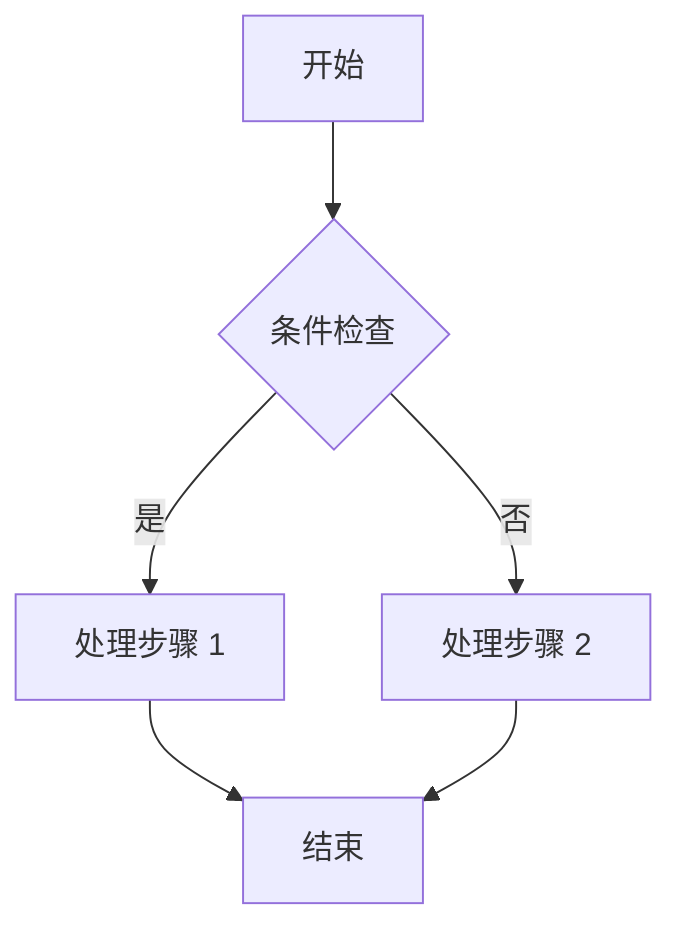
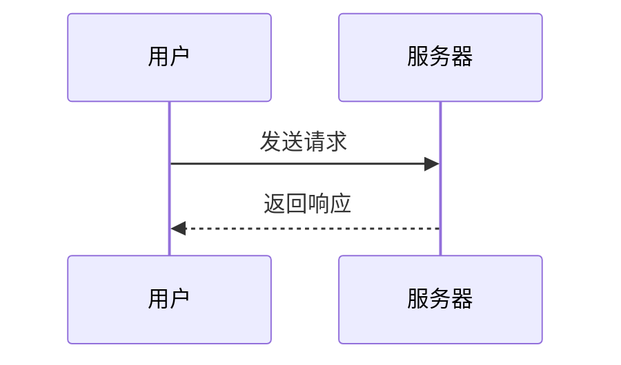
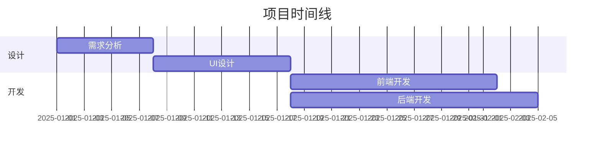
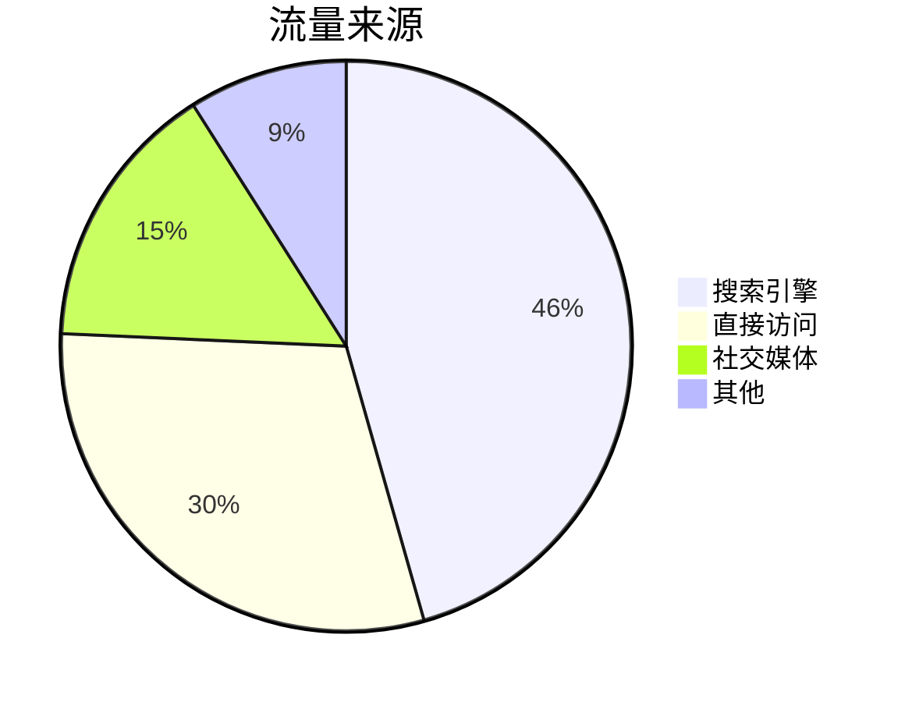
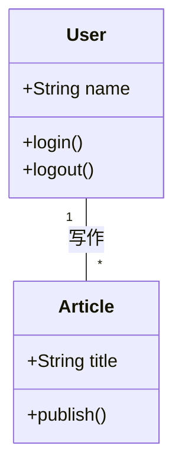
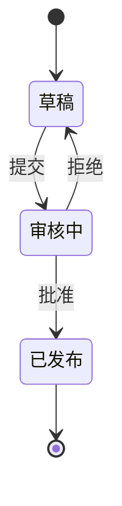

# 编写文章

本指南介绍如何在 Firefly 中编写和管理博客文章，包括 Frontmatter 配置、Markdown 语法、数学公式、Mermaid 图表、嵌入视频等。

## 文章存放位置

文章文件放置在 `src/content/posts/` 目录中。支持直接放置 `.md` / `.mdx` 文件，也可以创建子目录来组织文章和资源。

```
src/content/posts/
├── post-1.md
├── post-2/
│   ├── cover.png
│   └── index.md
└── category/
    └── post-3.md
```

## Front-matter

每篇文章顶部使用 YAML 格式的 Front-matter 来定义元数据：

```yaml
---
title: 我的第一篇文章
published: 2025-01-01
description: 这是文章的简短描述
image: ./cover.jpg
tags: [前端, 开发]
category: 前端开发
draft: false
---
```

### 完整属性列表

| 属性 | 类型 | 必填 | 说明 |
|------|------|------|------|
| `title` | `string` | 是 | 文章标题 |
| `published` | `date` | 是 | 发布日期 |
| `updated` | `date` | 否 | 更新日期，未设置则默认使用发布日期 |
| `description` | `string` | 否 | 文章简短描述，显示在首页文章卡片上 |
| `image` | `string` | 否 | 封面图片路径 |
| `tags` | `string[]` | 否 | 文章标签 |
| `category` | `string` | 否 | 文章分类 |
| `draft` | `boolean` | 否 | 是否为草稿，草稿不会对读者可见 |
| `pinned` | `boolean` | 否 | 是否置顶在文章列表顶部 |
| `slug` | `string` | 否 | 自定义 URL 路径 |
| `lang` | `string` | 否 | 文章语言代码（如 `zh-CN`），仅当与站点默认语言不同时设置 |
| `author` | `string` | 否 | 文章作者 |
| `comment` | `boolean` | 否 | 是否启用评论，默认 `true` |
| `licenseName` | `string` | 否 | 自定义许可证名称 |
| `licenseUrl` | `string` | 否 | 自定义许可证链接 |
| `sourceLink` | `string` | 否 | 文章来源链接 |
| `password` | `string` | 否 | 文章密码，设置后文章将被加密保护，详见 [文章加密](./password) |
| `passwordHint` | `string` | 否 | 密码提示，显示在密码输入框上方 |

### 封面图片路径

`image` 支持以下格式：

1. **相对路径**（相对于文章文件）：`./cover.jpg`
2. **public 目录**（以 `/` 开头）：`/assets/images/cover.webp`
3. **网络图片**（以 `http://` 或 `https://` 开头）：`https://example.com/cover.jpg`
4. **随机图 API**：`api`（需在 `coverImageConfig.ts` 中配置）

## 自定义 URL (Slug)

默认使用文件名作为 URL。可以通过 `slug` 自定义：

```yaml
---
title: 如何使用 Firefly
slug: how-to-use-firefly
---
```

文件：`src/content/posts/如何使用Firefly.md` → URL：`/posts/how-to-use-firefly`

### Slug 建议

- 使用英文和连字符：`my-awesome-post`
- 保持简洁，具有描述性
- 避免特殊字符，只使用字母、数字和连字符
- 发布后不要随意更改，避免影响 SEO 和已有链接

## 草稿

在 Front-matter 中设置 `draft: true` 可将文章标记为草稿。草稿文章不会显示在网站上：

```yaml
---
title: 草稿示例
draft: true
---
```

发布时将 `draft` 改为 `false` 即可。

## 数学公式 (KaTeX)

Firefly 内置 KaTeX 支持，可以渲染数学公式。

### 行内公式

使用单个 `$` 包裹：

```markdown
欧拉公式 $e^{i\pi} + 1 = 0$ 是数学中最优美的公式之一。
```

### 块级公式

使用 `$$` 包裹，会居中显示：

```markdown
$$
\int_{-\infty}^{\infty} e^{-x^2} dx = \sqrt{\pi}
$$
```

### 矩阵

```markdown
$$
\begin{pmatrix}
a & b \\
c & d
\end{pmatrix}
$$
```

### 求和与极限

```markdown
$$
\sum_{n=1}^{\infty} \frac{1}{n^2} = \frac{\pi^2}{6}
$$

$$
\lim_{x \to 0} \frac{\sin x}{x} = 1
$$
```

### 化学方程式

```markdown
$$
\ce{CH4 + 2O2 -> CO2 + 2H2O}
$$
```

更多语法请参考 [KaTeX 支持的函数](https://katex.org/docs/supported.html)。

## Mermaid 图表

Firefly 支持 Mermaid 图表，在代码块中指定 `mermaid` 语言即可。

### 流程图

````markdown

````

### 时序图

````markdown

````

### 甘特图

````markdown

````

### 饼图

````markdown

````

### 类图

````markdown

````

### 状态图

````markdown

````

## 提醒框 (Admonitions)

支持 GitHub、Obsidian、VitePress 三种风格（在 `siteConfig.ts` 的 `rehypeCallouts.theme` 中配置）。

### GitHub / VitePress 风格

```markdown
> [!NOTE] 提示
> 突出显示用户应该注意的信息。

> [!TIP] 建议
> 可选信息，帮助用户更成功。

> [!IMPORTANT] 重要
> 用户必须了解的关键信息。

> [!WARNING] 警告
> 需要立即注意的关键内容。

> [!CAUTION] 注意
> 行动的负面潜在后果。
```

### Docusaurus 风格

```markdown
:::note
这是一个提示信息。
:::

:::tip[自定义标题]
这是一个有自定义标题的提示。
:::
```

::: tip
更改提醒框主题后需要重启开发服务器才能生效。
:::

## GitHub 仓库卡片

使用以下语法嵌入 GitHub 仓库信息卡片（数据从 GitHub API 动态获取）：

```markdown
::github{repo="CuteLeaf/Firefly"}
```

## 嵌入视频

直接在 Markdown 中粘贴 iframe 嵌入代码即可。

### YouTube

```html
<iframe width="100%" height="468"
  src="https://www.youtube.com/embed/VIDEO_ID"
  title="YouTube video player"
  frameborder="0" allowfullscreen>
</iframe>
```

### Bilibili

```html
<iframe width="100%" height="468"
  src="//player.bilibili.com/player.html?bvid=BV_ID&p=1&autoplay=0"
  scrolling="no" border="0" frameborder="no"
  framespacing="0" allowfullscreen="true">
</iframe>
```

## 剧透文本

使用 `:spoiler[]` 语法隐藏文本内容，支持 Markdown 格式：

```markdown
内容 :spoiler[被隐藏了 **哈哈**]！
```

## MDX 格式

Firefly 同时支持 `.md`（Markdown）和 `.mdx`（MDX）格式。MDX 允许在文章中导入和使用 Astro/React 组件。

### 导入组件

```mdx
import { Icon } from 'astro-icon/components'

<div class="flex items-center gap-2 my-4">
  <Icon name="fa7-solid:rocket" class="text-4xl text-red-500" />
  <span>火箭发射！</span>
</div>
```

### 使用变量

```mdx
export const year = new Date().getFullYear()

今年是 {year} 年。
```

::: tip
如果没有特别复杂的需求，推荐使用 Markdown 格式。仅在需要嵌入 JSX 组件或动态数据时才使用 MDX。
:::
